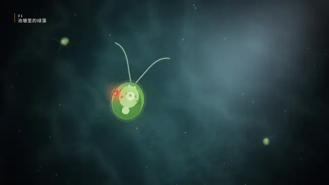
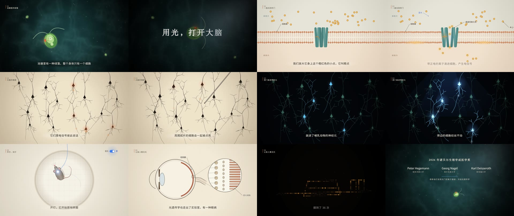
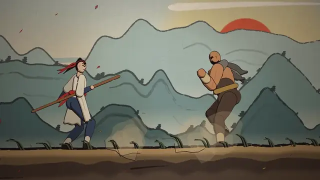
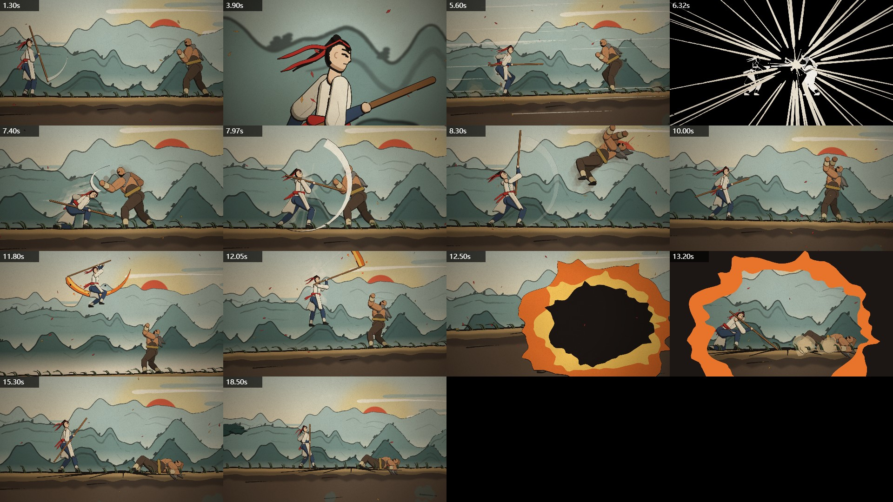
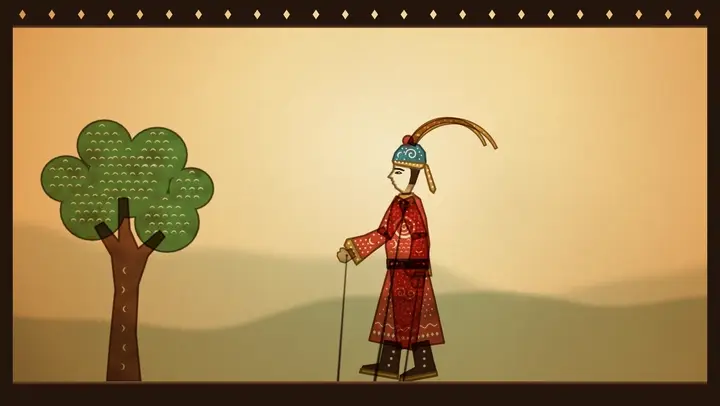
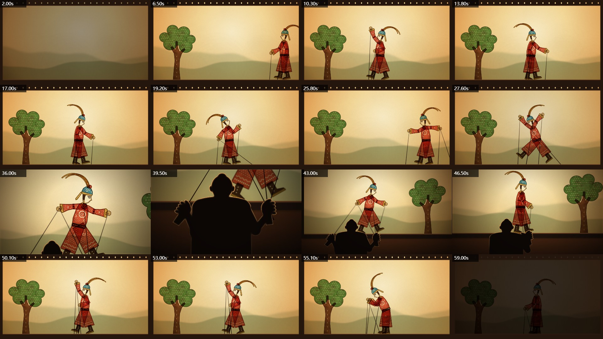
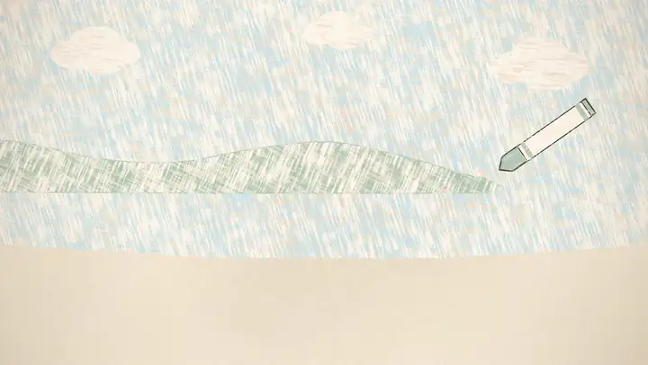
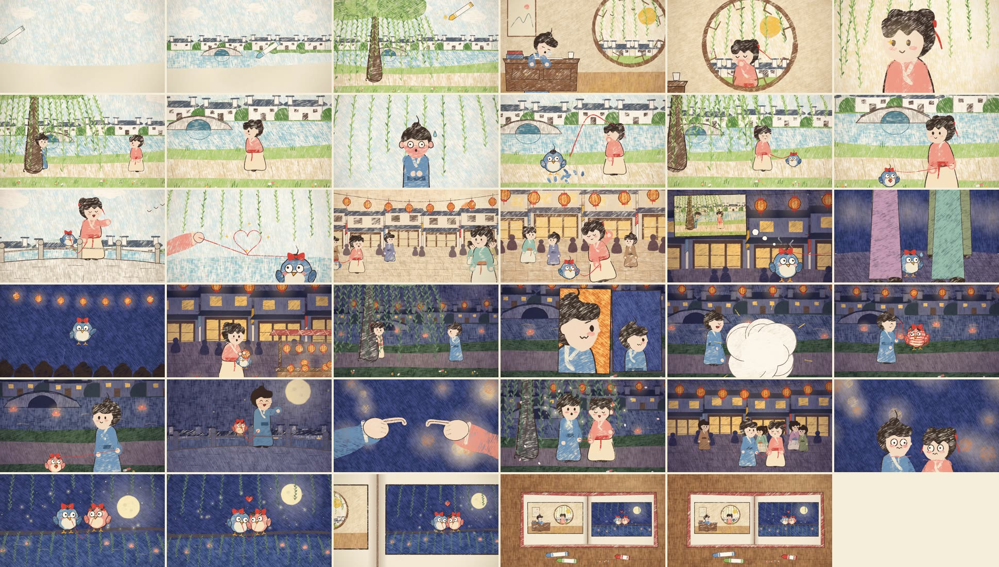
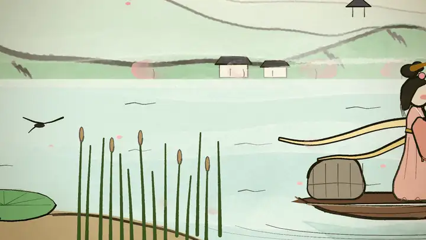
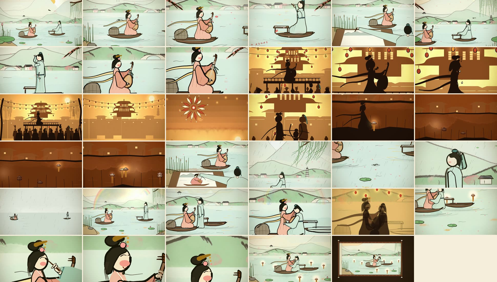

# paint-video

[中文](README.md) | English

A skill that teaches AI agents to paint hand-drawn animated shorts and music videos in code.

Every frame is a pure function of time t. It is painted stroke by stroke, rendered to images in parallel by headless Chrome, and assembled into an MP4 with ffmpeg. There is no AI-generated imagery anywhere in the picture; all of it is drawn by code. The skill holds the whole method for making a film plus the pitfalls we hit along the way, so an agent can go from a one-line request to a finished video.

The skill documents are written in Chinese. Agents read them fine and can reply in any language.

## Films made with it

### *Light Switch for the Brain* · science explainer

3 minutes 5 seconds on the 2026 Nobel Prize in Physiology or Medicine: how a pond alga "sees" light, how that light-gated door was put into neurons and became a switch for the brain, and how it later gave a blind patient back part of his sight. Eight scenes in eight styles (underwater microscopy, paper diagrams, Cajal-style ink neurons, fluorescence, a top-down open field, an engraved eye cross-section, a dot-matrix point of view), with subtitles and labels. Sound effects are synthesized in code and the Chinese narration comes from edge-tts; picture, sound and voice share one timeline. The whole film's code is in `explainer-kit/`.



<details>
<summary>The whole film</summary>



</details>

### *Shiquan* (Sparring) · colored ink-wash fight

19.5 seconds, silent, in the colored ink-wash style of *Fog Hill of Five Elements*. A standoff on a cliff, staff meets fist, a duck under a hook into a rising strike that drags the staff along the ground, and a leaping, flaming overhead slam that bursts fire and ink across the screen. Figures are brush-outlined with flat color and a shadow tone; motion runs on smooth curves through the keyframes, and feet are planted step by step so they never slide. Contact points are lined up by computing joint coordinates with a probe. The whole film's code is in `inkfight-kit/`.



<details>
<summary>All shots</summary>



</details>

### *Two Hands* · shadow puppet short

60 seconds, no song. A little general tries to strike his pose, but his arm is yanked around the stage by an extra rod; behind the screen, both rods turn out to be held by the two hands of the same person. Every leather piece is carved with cut-outs and multiplied onto a lamp-lit screen. The clappers, drums, gongs and cymbal crashes are all synthesized with numpy and placed on the beat with the action. The whole film's code, storyboard and synthesizer are in `piying-kit/`.



<details>
<summary>All shots</summary>



</details>

### *Daitouniao* (The Dumb Bird) · crayon picture-book MV

2:29, 36 shots. Oil-pastel crayon with comic-strip panels: a riverside town in southern China from dawn to night, where the boy panics and turns into a round, dumb-looking bird with a *poof*. From script to subtitled final cut in under 2 hours.



<details>
<summary>Whole film at a glance</summary>



</details>

### *Pipa Qu* (Pipa Song) · watercolor MV

2:09, 39 shots. Brush-drawn figures in the style of Feng Zikai, with no facial features; the lantern festival switches to silhouettes against warm light, and the ending pulls back into a hanging scroll.



<details>
<summary>Whole film at a glance</summary>



</details>

### *Luokuan* (The Seal) · ink-wash short

16.8 seconds. A drop of ink blooms into distant mountains; wherever the small red figure walks, reeds and a river get painted in, until it sits down and becomes the seal on the finished painting. Scene code: `examples/brush/ink.js`.


### *Shixing* (Catching Stars) · watercolor short

14.5 seconds, the first test film. Clawd holds an empty jar, catches falling stars, and a jar of starlight slowly warms the night. Scene code: `examples/brush/stars.js`.


The two songs are copyrighted, so this repository contains no audio or lyrics. All previews above are silent; the percussion of *Two Hands* is synthesized, so running `piying-kit/sound/synth.py` regenerates it; the sound and narration of *Light Switch for the Brain* come from `explainer-kit/tools/audio.js` and `tools/voice.js`.

## What it teaches the agent

- **Five rendering engines**
  - Watercolor, ink wash, printmaking: p5.js + p5.brush, built on [ClaudeAnimationBase](https://github.com/JohnHeibel/ClaudeAnimationBase), about 1 second per frame.
  - Crayon picture book: a 2D canvas engine written for this repo, `crayon-kit/`, 10–50 ms per frame.
  - Shadow puppets: a 2D canvas engine written for this repo, `piying-kit/`, 2–10 ms per frame, with synthesized percussion.
  - Colored ink-wash fights: a 2D canvas engine written for this repo, `inkfight-kit/`, 20–100 ms per frame.
  - Science explainers: a 2D canvas engine written for this repo, `explainer-kit/`, 60–130 ms per frame, with synthesized sound effects and edge-tts narration.
- **Rules of filmmaking**: one thing for the viewer to watch per shot, cause before reaction; give the audience time to understand; a transition at every seam; no text in the picture; rich but not cheap, no confetti or sparks as filler.
- **A checking loop**: after every shot, render a contact sheet, consecutive frames, and zoomed crops, then look at them with an image viewer. Check for teleporting, floating hands, flipped facing, props covering faces, muddy colors. You cannot tell whether an animation works by reading code.
- **A full music-video workflow**: beat analysis → a shot list written in beat numbers (change the edit in one place) → cheap style tests → a parts library → batches with self-review → targeted reshoots → color grading with ffmpeg.
- **Lyric subtitles**: a separate transparent PNG layer composited on top, vertical text revealed half a line at a time. In the crayon version the text has the same paper grain and jitters with the picture; a *probe* records where characters are actually drawn in every frame so the layout avoids them.
- **A directing handbook**: shot sizes, the 180° line and the 30° rule, where to cut, pause-burst-pause rhythm, composition and eye-trace, character acting, action-scene principles, and a storyboard checklist. Written so that models which only follow instructions can use it too.
- **How to make an explainer**: check the news and the original sources before writing; rules for subtitles, chapter tags and leader-line labels; transitions chosen by content; loudness measured section by section; narration generated line by line, stretching the picture wherever a line runs long, with the background ducking under the voice.
- **A counterexample**: a test film that obeyed every rule and still had no story, with a point-by-point account of why.

## Layout

| Path | Contents |
|---|---|
| `paint-video/` | The skill itself. `SKILL.md` for shorts, `mv-workflow.md` for long films and MVs, `crayon.md` for the crayon style, `piying.md` for shadow puppets, `wushan.md` for colored ink-wash fights, `directing.md` a directing handbook for every style (storyboards, shot sizes, the 180° line, cutting, rhythm, acting), `explainer.md` for science explainers |
| `crayon-kit/` | Crayon engine, characters (3-heads-tall figures and the bird), parts library, a 16-second demo, lyric subtitle tools |
| `piying-kit/` | Shadow puppet engine, jointed puppet on rods, the complete code and storyboard of the 60-second *Two Hands*, percussion synthesizer |
| `inkfight-kit/` | Colored ink-wash engine, brush-outlined cel-shaded figure rig, the complete code of the 19.5-second fight *Shiquan*, `probe.mjs` for joint coordinates, a 24-move library `moves.js` (`plan()` chains moves by contact time, with a demo duel) |
| `explainer-kit/` | Explainer engine, the complete code of the 3-minute *Light Switch for the Brain*, the sound synthesizer `tools/audio.js`, the narration script `tools/voice.js` |
| `examples/brush/` | Scene code for *Shixing* and *Luokuan*; drop into ClaudeAnimationBase to run |
| `tools/` | `analyze.py` for beats and sections, `make_shotlist.py` shot-list template |
| `docs/` | Preview images for the README |

## Install

```bash
git clone https://github.com/nzl153/paint-video-skill
```

Copy `paint-video/` into your agent's skills directory: `~/.claude/skills/` for Claude Code, `~/.codex/skills/` for Codex. Keep the repository around; the skill looks inside it for `crayon-kit/` and the examples.

Requirements:

- Node 18+, Chrome or Chromium, ffmpeg (on PATH)
- Subtitle tools: Python 3, numpy, Pillow
- Shadow puppet percussion: Python 3, numpy, scipy
- Explainer narration: Python 3 and `pip install edge-tts` (needs access to Microsoft's speech service; set `TTS_PROXY` if you need a proxy)
- Beat analysis: also scipy, matplotlib
- Watercolor style: also clone [ClaudeAnimationBase](https://github.com/JohnHeibel/ClaudeAnimationBase) and run `npm install`

## Try the crayon demo

```bash
cd crayon-kit
npm install
node render.mjs --sheet=1,4,8,12 --cols=4 --w=480 --out=out/check/sheet.jpg    # contact sheet
node render.mjs --loop=cast --sheet=1 --cols=1 --w=960 --out=out/check/cast.jpg # character sheet
node render.mjs --frames --workers=4                                            # render all frames
node render.mjs --encode --out=out/demo.mp4                                     # encode
```

16 seconds, 384 frames; about 45 seconds with 4 workers.

## Usage

Once installed, just tell the agent what you want, for example:

- "Make a 15-second crayon picture-book short: a puppy chases a falling leaf until it lands on its nose."
- "Make an ink-wash short, about 16 seconds, of a crane stepping out of the paper."
- "Turn this song (audio and LRC lyrics attached) into a landscape music video. Show me the script first."

The agent writes a storyboard for you to review, then builds shot by shot, rendering and checking each one before moving on. For long films it shows you still contact sheets batch by batch and renders motion only after you approve.

## Performance

Measured on an RTX 4060 laptop:

| | Per frame | Example |
|---|---|---|
| Crayon engine | 10–70 ms | 2:29 MV, 3590 frames, about 4 minutes with 4 workers |
| Shadow puppet engine | 2–10 ms | 60 s, 1440 frames, about 2 minutes straight to MP4 with one worker |
| Colored ink-wash fight engine | 20–100 ms | 19.5 s, 468 frames, under 1 minute with 4 workers |
| Explainer engine | 60–130 ms | 3:05, 5550 frames, about 9 minutes straight to MP4 with one worker |
| p5.brush watercolor | about 1–2 s | 2:09 MV, 3102 frames, about 1.5–2 hours with 3 workers |
| Subtitle layer | — | whole film including compositing, about 3–8 minutes with 6 workers |

## Acknowledgements

- [PDoomVideo](https://github.com/JohnHeibel/PDoomVideo): a two-and-a-half-minute MV generated by Claude in Claude Code, the starting point of this approach (that repository has no license; none of its code is used here).
- [ClaudeAnimationBase](https://github.com/JohnHeibel/ClaudeAnimationBase) (MIT): the p5.brush base; the `render.mjs` of `crayon-kit/`, `piying-kit/` and `inkfight-kit/` is adapted from it.
- [paint-mv-skills](https://github.com/lintsinghua/paint-mv-skills) (MIT): reference for lyric timing and audio analysis.
- Recommended fonts: [Ma Shan Zheng](https://fonts.google.com/specimen/Ma+Shan+Zheng), [Long Cang](https://fonts.google.com/specimen/Long+Cang), [Zhi Mang Xing](https://fonts.google.com/specimen/Zhi+Mang+Xing), all OFL, download them yourself.

## License

MIT, see [LICENSE](LICENSE).
